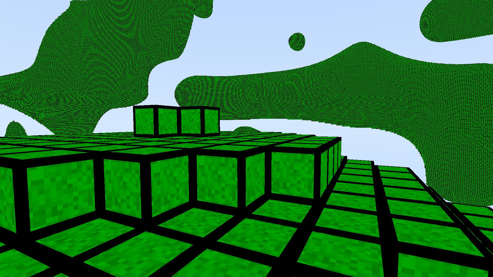

# Description:

This is a realtime voxel raytracer written in C++. Using OpenCL, it uses the GPU to accelerate the raytracing.
This was built for learning purposes. Other than OpenCL, there are no third party libraries used in this project, and usage of the C++ standard library is kept to a minimum.

This project uses sparse voxel octree raytracing. The octree data is stored as a linear octree, so the morton codes of the nodes are used as indices into an array of octree nodes.
The size of the voxel grid is 512x512x512, and it is randomly generated using 3D value noise.
Both the voxel grid and octree generation can be done in a highly parallel way, so they are done on the GPU through OpenCL. This makes the generation very fast.
The entire voxel grid and the octree acceleration structure are fully rebuilt every frame, and the noise is animated over time.

The sparse voxel octree raytracing algorithm can be found in the file VoxelRaytracer\ForgeData\OpenCL\Include\ProgramIntersectionTests.cl.
The voxel and octree generation are in the files VoxelRaytracer\ForgeData\OpenCL\Source\GenerateVoxel.cl and VoxelRaytracer\ForgeData\OpenCL\Source\GenerateNode.cl.

This has been tested on an Nvidia RTX 3070 laptop GPU, and it ran at a resolution of 1920x1080 at a framerate of around 70 FPS, when the generation was turned on.
When the generation was turned off, and only the raytracing was happening, and the framerate stayed over 160 FPS most of the time.

Visual Studio is needed to build the project. It has only been tested with Visual Studio 2022.
This project will only work on the Windows operating system, as it uses the Windows API to access platform functionality.
It has only been tested on Windows 11, but should work on some older versions of Windows as well.
This has also only been tested on an Nvidia RTX 3070 laptop GPU. But it should work on many other GPUs.
It does not require hardware raytracing support. The raytracing is done manually using OpenCL kernels.

# Build Instructions:

1. Open the "Forge.sln" file using Visual Studio.
2. Click on the "Build Solution" option from the "Build" menu, and wait for the build to complete.
3. Right click the VoxelRaytracer project and select the "Set as Startup Project" option.
4. Select the "Start Without Debugging" option in the "Debug" menu to run the program from within Visual Studio.

# Controls:

**WASD keys** - Move camera

**Hold right click and move mouse** - Rotate camera

**G key** - Toggle realtime voxel grid and octree generation

**V key** - Toggle octree visualization

**1 key** - Toggle face edit tool (Will only work when generation is turned off).
		When then tool is active, click on any voxel face, drag and then release to create new voxels.
		Please note that all edits will be wiped out once generation is turned on

**2 key** - Toggle block edit tool (Will only work when generation is turned off).
		When then tool is active, the corner selector will be drawn as a red box.
		To move the corner selector, move the mouse and use the scroll wheel.
		Move the corner selector and click two times to select the corners of a block and fill in that block with voxels.
		Please note that all edits will be wiped out once generation is turned on

**Left Ctrl + Z** - Undo (Will only work when generation is turned off)

**Left Ctrl + Left Shift + Z** - Redo (Will only work when generation is turned off)
